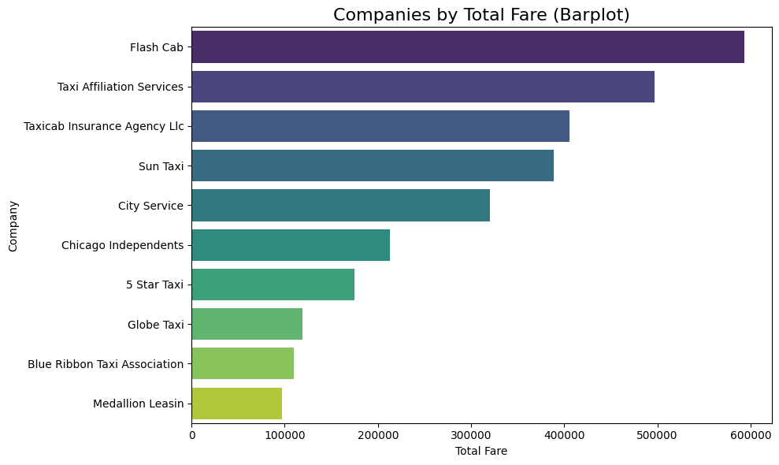
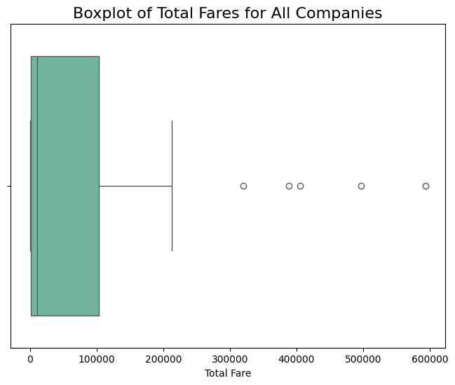
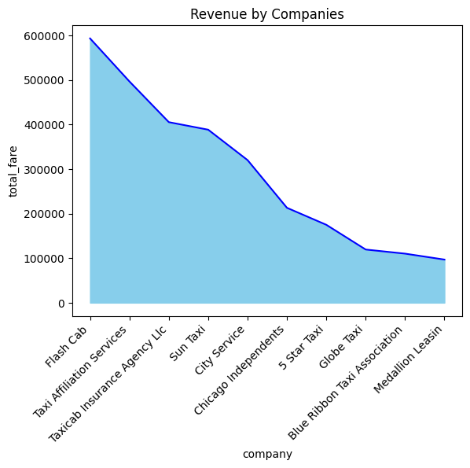
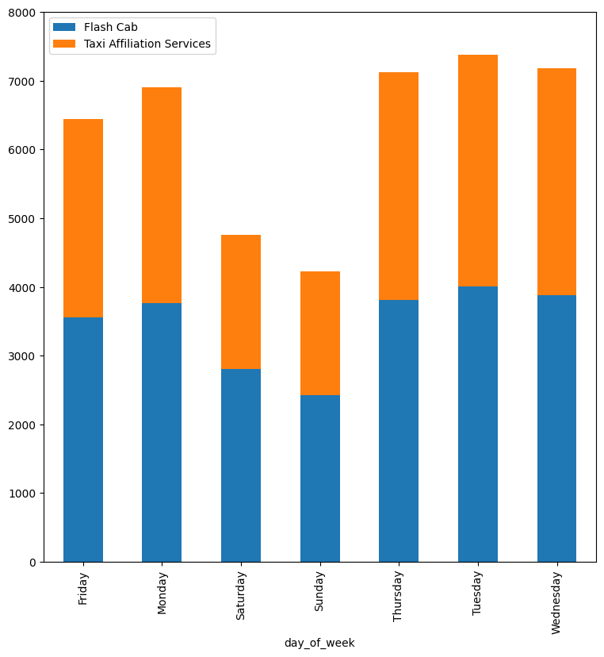
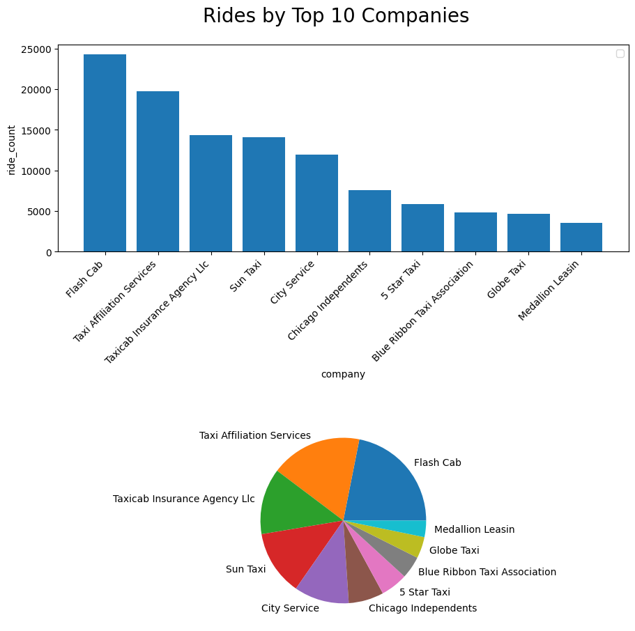

# Cubix Data Engineering Course - Capstone Project
cubix_data_engineering_homework4

## Modules of the project:

### 1. Get and upload daily taxi and weather data from the following locations:
https://open-meteo.com/  
https://data.cityofchicago.org  
Notebook: aws_extract.ipynb

### 2. Transform and load the daily taxi and weather data and creating helper files
Notebook: aws_transform_load.ipynb

### 3. Join taxi and weather data to one single csv file (offline) 
Notebook: local visualization.ipynb

### 4. AWS Athena Queries
Notebook: aws_athena_queriea.ipynb

### 5. Visualization from local computer
Notebook: local_visualization.ipynb

Chart 1: Revenue of the companies (boxplot)

Chart 2: Revenue of the top 10 companies (barchart)

Chart 3: Revenue of the top 10 companies (areachart)

Chart 4: Number of rides by days of week of the top 2 companies

Chart 5: Number of rides of top 10 companies

## Requirements:
1. Python 3.10.0 
2. Package versions:
beautifulsoup4     4.12.3  
boto3              1.35.13  
botocore           1.35.13  
ipykernel          6.29.5  
ipython            8.26.0  
matplotlib         3.9.2  
numpy              2.0.1  
pandas             2.2.2  
pip                24.2  
requests           2.32.3  
seaborn            0.13.2  